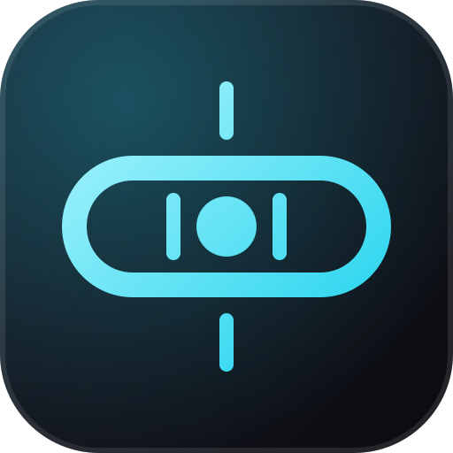

<div align="center">



# Zero Drift

**Una skill para Claude Code que mantiene ancladas las sesiones largas con IA.**<br>
Las respuestas abren con tu nombre. Las tareas guardan un `TASK.md` desde el que la siguiente sesión retoma el trabajo.

[](LICENSE)
[](https://github.com/obrenoalvim/zero-drift/stargazers)
[](#inicio-rápido)

[English](README.md) · [Português](README.pt.md) · **Español**

[El problema](#el-problema) · [Inicio rápido](#inicio-rápido) · [Las dos reglas](#las-dos-reglas) · [Cómo funciona](#cómo-funciona) · [Instalación](#instalación) · [Preguntas frecuentes](#preguntas-frecuentes)

</div>

---

Zero Drift es una skill para Claude Code con dos reglas, aplicadas desde la primera respuesta hasta la última. Instálala como plugin y se carga al inicio de cada sesión.

## El problema

Las sesiones largas se degradan. La ventana de contexto se llena, abres una instancia nueva de Claude y pierdes diez minutos volviendo a explicar lo que estabas haciendo. Para entonces la IA ya empezó a derivar: inventa trabajo que nunca hizo y olvida decisiones que ya tomaste.

Zero Drift te da una forma de detectar la deriva a tiempo y de traspasar el contexto sin pérdidas.

## Inicio rápido

```
/plugin marketplace add obrenoalvim/zero-drift
/plugin install zero-drift@zero-drift
```

Abre una ventana nueva de Claude Code. Si la primera respuesta empieza con tu nombre, Zero Drift está activo. Las demás opciones de instalación están en [Instalación](#instalación).

---

## Las dos reglas

### 1. Respuesta con nombre
La IA abre cada respuesta con tu nombre. Así las respuestas se sienten personales y es fácil encontrarlas en un log largo.

```
Breno: el bug de auth está en middleware.ts:42, la expiración del token usa < en lugar de <=.
```

La IA lee tu nombre de `git config user.name` o de tu `CLAUDE.md`. Si no encuentra nada, te lo pregunta una vez.

**El nombre es tu detector de alucinaciones.** Cuando el modelo empieza a derivar, el nombre se rompe primero: desaparece, cambia o suena raro. Esa es la señal de que la sesión se está degradando. Abre una ventana nueva, di *"lee el TASK.md y continúa"* y retoma desde un estado limpio.

### 2. Documento de tarea vivo
Cada tarea recibe un `TASK.md` en la raíz del proyecto. Después de cada prompt relevante, la IA registra lo que hizo, lo que se rompió, lo que corrigió y cómo están las cosas ahora.

El Registro es un historial de hechos comprobables, no un diario. La IA no puede afirmar "corregí X". Muestra la prueba: el comando ejecutado, su salida, el exit code. Sin prueba no hay entrada en el Registro; el trabajo sin comprobar va a `No verificado / Pendiente`. El `Estado actual` solo puede decir que algo funciona si esa prueba está en el Registro. Cuando el contexto se degrada, el modelo se inclina hacia la fluidez antes que hacia la verdad, y la regla de evidencia es lo que hace confiable el traspaso en lugar de una historia verosímil.

Cuando el contexto se llene, abre una sesión nueva y dile:
> "Lee el TASK.md y continúa."

La instancia nueva lee el archivo y retoma donde quedó la anterior.

---

## Estructura del TASK.md

```markdown
# TASK: [Nombre de la tarea]
> Creado: YYYY-MM-DD | Actualizado: YYYY-MM-DD HH:MM

## Objetivo
Qué estamos construyendo o corrigiendo.

## Plan
- [x] Paso completado
- [ ] Paso pendiente

## Registro
### YYYY-MM-DD
- Agregó retry en fetchUser(): `npm test auth` -> 12 passed, exit 0
- Corrigió null deref en parse(): `cargo test parse` -> ok. 3 passed, exit 0

## No verificado / Pendiente
- Refactorizó la capa de caché: NO probado todavía, sin prueba

## Errores y correcciones
| Error | Causa | Corrección | Evidencia |
|-------|-------|------------|-----------|

## Estado actual
Párrafo de traspaso para una instancia nueva. Reescríbelo cada vez para que
describa siempre el ahora. Solo afirma que algo funciona si su prueba está en
el Registro; si no, escribe "implementado, no verificado".
```

---

## Cómo funciona

1. Un hook `SessionStart` ([`hooks/inject.js`](hooks/inject.js)) lee [`skills/zero-drift/SKILL.md`](skills/zero-drift/SKILL.md) y lo agrega al contexto de cada sesión nueva.
2. Claude busca tu nombre en este orden: `git config user.name`; una línea con tu nombre en `CLAUDE.md`, `AGENTS.md` o `GEMINI.md`; una presentación tuya al inicio de la sesión. Si las tres fallan, te pregunta una vez.
3. Cuando empiezas una tarea con nombre y objetivo ("construyamos X", "corrige este bug"), Claude crea el `TASK.md` en la raíz del proyecto y lo actualiza después de cada prompt que hace avanzar la tarea.

---

## Instalación

### Recomendado: instala como plugin (global, automático)

Esta es la **única** opción que activa Zero Drift por sí sola en **todas** las sesiones. El plugin incluye un hook `SessionStart` que inyecta las reglas en cada ventana nueva de Claude Code, así que no invocas ni configuras nada por sesión.

```
/plugin marketplace add obrenoalvim/zero-drift
/plugin install zero-drift@zero-drift
```

Después abre una ventana nueva de Claude Code. Desde ese momento, cada sesión empieza con Zero Drift activo: las respuestas abren con tu nombre y las tareas reciben un `TASK.md`. Para confirmar que cargó, revisa que la primera respuesta en una ventana nueva empiece con tu nombre.

**Requisito:** Node.js en tu `PATH`. El hook ejecuta `node hooks/inject.js`.

> **Nota sobre los términos:** el *plugin* es el paquete; el hook `SessionStart` que contiene es lo que vuelve el comportamiento *global y automático*. Al instalar el plugin obtienes ambos. Las opciones manuales de abajo dejan la skill disponible pero **no** la activan solas.

### Alternativas manuales (sin plugin)

Funcionan sin instalar el plugin, pero requieren configuración y no se activan globalmente por sí solas.

**Pega en CLAUDE.md**: agrega esto a `~/.claude/CLAUDE.md` (global) o a un `CLAUDE.md` del proyecto:

```markdown
# Zero Drift
Sigue las reglas de la skill Zero Drift:
1. Empieza cada respuesta con mi nombre (detéctalo con git config o pregunta)
2. Para cada tarea específica, mantén TASK.md en la raíz del proyecto y actualízalo después de cada prompt
Reglas completas: https://github.com/obrenoalvim/zero-drift/blob/main/skills/zero-drift/SKILL.md
```

**Apunta la IA a este repositorio**: inicia una sesión y di:
> "Lee https://github.com/obrenoalvim/zero-drift y sigue la skill Zero Drift."

La IA lee el SKILL.md y aplica las dos reglas.

**Copia el archivo de la skill**: copia `skills/zero-drift/SKILL.md` a tu directorio de skills y cárgalo con tu sistema de plugins, como superpowers.

---

## Traspaso de contexto

El flujo que lleva un proyecto largo de una instancia a otra:

1. La sesión se llena, así que la IA actualiza `Estado actual` en el TASK.md
2. Abres una sesión nueva de Claude Code
3. Dices: **"Lee el TASK.md y continúa"**
4. La IA lee el archivo, confirma dónde están las cosas y retoma desde ahí

Te ahorras volver a explicar y la IA se ahorra adivinar.

---

## Compatibilidad

Funciona con cualquier IA que lea markdown:
- Claude Code (claude.ai/code)
- Cursor
- GitHub Copilot (vía AGENTS.md)
- Codex
- La API de Claude

El hook automático `SessionStart` es específico de Claude Code. Para las demás, usa las [alternativas manuales](#alternativas-manuales-sin-plugin).

---

## Preguntas frecuentes

**¿Zero Drift envía mis datos a algún lugar?**
No. El hook lee un archivo del disco y lo imprime como contexto de la sesión. No hace llamadas de red. Si el archivo no existe, el hook no imprime nada, así que una instalación rota nunca impide que la sesión arranque.

**¿Qué hago cuando Claude olvida o cambia mi nombre?**
Tómalo como la señal de que la sesión se está degradando. Abre una ventana nueva y di "Lee el TASK.md y continúa".

**¿Puedo usarlo con Cursor, Codex o Copilot?**
Sí. Pon el fragmento de [Alternativas manuales](#alternativas-manuales-sin-plugin) en tu `AGENTS.md` o en tu archivo de reglas.

---

## Más skills para Claude Code del mismo autor

- [**keep-improving**](https://github.com/obrenoalvim/keep-improving): un bucle autónomo de mejora con un panel de revisión de diez roles.
- [**findable**](https://github.com/obrenoalvim/findable): investigación de SEO y GEO que aplica las correcciones seguras.
- [**unblock**](https://github.com/obrenoalvim/unblock): una cadena gratuita de 13 herramientas para investigación web que sigue intentando.
- [**no-watermark**](https://github.com/obrenoalvim/no-watermark): detecta y elimina marcas de agua Unicode invisibles en el texto.

## Contribuir

¿Encontraste un hueco en las reglas o un caso que la skill no cubre? Abre un PR. El SKILL.md es la fuente de verdad. Consulta el [CONTRIBUTING.md](CONTRIBUTING.md) y el [changelog](CHANGELOG.md).

## Licencia

[MIT](LICENSE)

---

<div align="center">

Si Zero Drift te ahorró volver a explicar todo, una ⭐ ayuda a que otras personas que usan Claude Code encuentren el proyecto.

<sub>**Temas:** claude-code · claude-skill · claude-code-plugin · context-management · session-handoff · hallucination · ai-agents · prompt-engineering · cursor · llm</sub>

</div>
